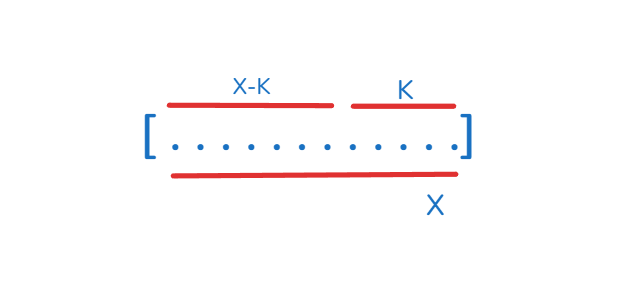

# HASHING CONCEPTS

## QUESTIONS
| Question | Level |
|----------|-------|
| [Identify the largest Outlier in the array (3371)](https://leetcode.com/problems/identify-the-largest-outlier-in-an-array/description/) | Medium |
| [Group Anagrams (49)](https://leetcode.com/problems/group-anagrams/description/) | Medium |
| [Longest Consecutive Sequence (128)](https://leetcode.com/problems/longest-consecutive-sequence/) | Medium |
| [Valid Anagram (217)](https://leetcode.com/problems/valid-anagram/description/) | Easy |
| [Top K Frequent Elements (347)](https://leetcode.com/problems/top-k-frequent-elements/description/) | Medium |
| [Minimum Window String (76)](https://leetcode.com/problems/minimum-window-substring/description/) | Hard |

## HASH(SUM, INDEX)
1. This technique is useful when you wish to find longest subarray with sum as K.
2. The idea behind it is to hash (sum, index) during iteration inorder to find the sum K which might exists if totalSum-K exists in the hashmap.
3. Since we need to find the longest subarray there may be a possibility that same sum exists at different indexes. In this case we do not update the (sum, index) entry if the index is higher than the entry's index.

## PRE-FILLED MAP
1. This technique is useful when you wish to to check whether characters of a string A exists in substring of another string B.
2. The brute force approach is to check at every stage of traversal whether the current substring has all the characters or not. The time complexity of this approach is O(K*N).
3. To remove the extra checking loop during traversal, we prefill the map with the characters of the string A and maintain a count variable (value = count of characters).
4. During iteration, if the character of substring is present in the map, you update the map and decrease the count by 1 otherwise append the character in the map with value as -1.
5. When the count reduces to zero, the current substring has all the characters of string A.
6. The pre-inserted characters will have a value zero and the other characters which were not pre-inserted will have a negative value.
7. Start reducing the window size in order to find the minimum window. As long as the count variable is zero the current substring has all the minimum characters.
8. While reducing the substring, update the character count in the map. If the value of the character is negative it implies that it is not a pre-inserted character in this case do not update the count otherwise increase the count. 