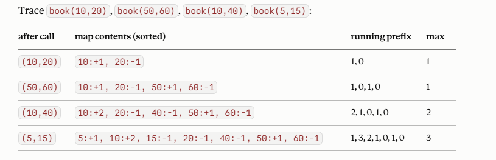

# PREFIX SUM & DIFFERENCE ARRAY

## QUESTIONS
| Question | Level |
|----------|-------|
| [Zero Array Transformation II (3357)](https://leetcode.com/problems/zero-array-transformation-ii/description/) | Medium |
| [Car Pooling (1094)](https://leetcode.com/problems/car-pooling/submissions/2118095148/) | Medium |
| [Corporate Flight Bookings (1109)](https://leetcode.com/problems/corporate-flight-bookings/description/) | Medium |

## DIFFERENCE ARRAY

### PROBLEM
1. You have an array of n zeros. You're given m operations, each (l, r, v) meaning add v to every element from index l to r inclusive.
2. The brute force approach takes O(N*M)- but with N = M = 10^5 will result into O(N^2)

### SOLUTION
[](../assets/Diff_Array-1.png)
1. For the range update [L, R, V] perform diff_arr[L] += V and diff_arr[R+1] -= V. This require the diff_arr to have a size of N+1.
2. After applying N queries take prefix sum of the diff_arr. 

### VARIANT A (HALF OPEN INTERVALS - [S, E))
1. Perform arr[L] += V & arr[R] -= V.
2. Consider leetcode problem [Car Pooling (1094)](https://leetcode.com/problems/car-pooling/submissions/2118095148/) where trips[i] = [numPassengers, from, to]. Since at position end/to the passenger can either get down or get inside or both this requires the update to change from arr[R+1] -= V to arr[R] -= V.

### VARIANT B (SPARSE COORDINATES)
1. The array template needs new int[n + 1]. That's fine when n ≤ 10^6. But problems constantly hand you constraints like 0 <= start < end <= 10^9, or timestamps, or arbitrary long coordinates. Allocating 10^9 ints is 4 GB — impossible.
2. Here's the key observation: you only ever write to 2m cells. With m = 10^5 intervals, exactly 200,000 positions are non-zero and every other cell is a useless zero that contributes nothing to the prefix sum. So store only the non-zero cells, keyed by coordinate.
3. The requirement is that you can iterate the keys in sorted order, because prefix-summing means accumulating left to right. That's exactly TreeMap's contract.

```Java
import java.util.*;

TreeMap<Integer, Integer> delta = new TreeMap<>();

for (int[] arr : intervals) {
    delta.merge(arr[0],  1, Integer::sum);   // interval opens
    delta.merge(arr[1], -1, Integer::sum);   // interval closes (half-open [s, e))
    // same as delta.merge(arr[0], 1, (oldVal, newVal) -> oldVal + newVal)
    // same as map.put(k, map.getOrDefault(k, 0) + v) (2 lookups)
}

int cur = 0, best = 0;
for (int v : delta.values()) {              // ascending key order, guaranteed
    cur += v;
    best = Math.max(best, cur);
}
```


### VARIANT C (2D DIFF ARRAY)

```Java
class Solution {
    public int[][] rangeAddQueries(int n, int[][] queries) {
        int[][] d = new int[n + 2][n + 2];

        for (int[] q : queries) {
            int r1 = q[0], c1 = q[1], r2 = q[2], c2 = q[3];
            d[r1]    [c1]     += 1;
            d[r1]    [c2 + 1] -= 1;
            d[r2 + 1][c1]     -= 1;
            d[r2 + 1][c2 + 1] += 1;
        }

        int[][] ans = new int[n][n];
        for (int i = 0; i < n; i++) {
            for (int j = 0; j < n; j++) {
                int up   = i > 0 ? ans[i - 1][j] : 0;
                int left = j > 0 ? ans[i][j - 1] : 0;
                int diag = (i > 0 && j > 0) ? ans[i - 1][j - 1] : 0;
                ans[i][j] = d[i][j] + up + left - diag;
            }
        }
        return ans;
    }
}
```